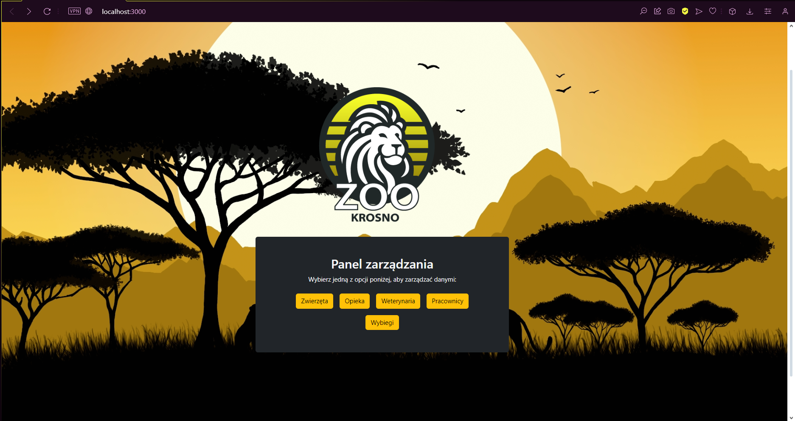
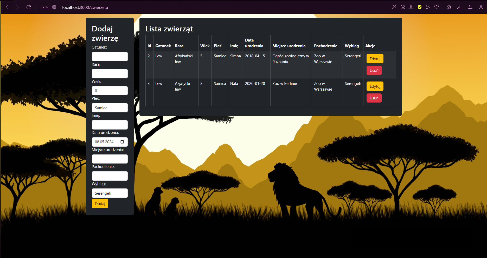

# Zoo Management Web Application

This is a web application designed for managing a Zoo. It provides comprehensive functionalities to handle various aspects of zoo operations.

## Features

- **Animal Management**: Keep track of all the animals in the zoo, their health status, feeding schedules, and more.
- **Caregiver Management**: Manage the caregivers assigned to each animal, their schedules, and responsibilities.
- **Employee Management**: Handle details of all the employees in the zoo, their roles, schedules, and payroll.
- **Enclosure Management**: Manage the various enclosures in the zoo, their maintenance schedules, and assigned animals.
- **Veterinary Services**: Keep track of veterinary care provided to the animals, schedule regular check-ups, and handle emergency situations.

The application allows adding, deleting, editing, and viewing details related to each of these aspects.

## Technologies Used

- **SpringBoot**: For creating stand-alone, production-grade Spring based Applications.
- **PostgreSQL**: As the relational database to store all the data related to the zoo.
- **React**: For building the user interface of the web application.
- **Bootstrap**: For designing and customizing responsive mobile-first sites.

### Image HOME

### Image ANIMALS

